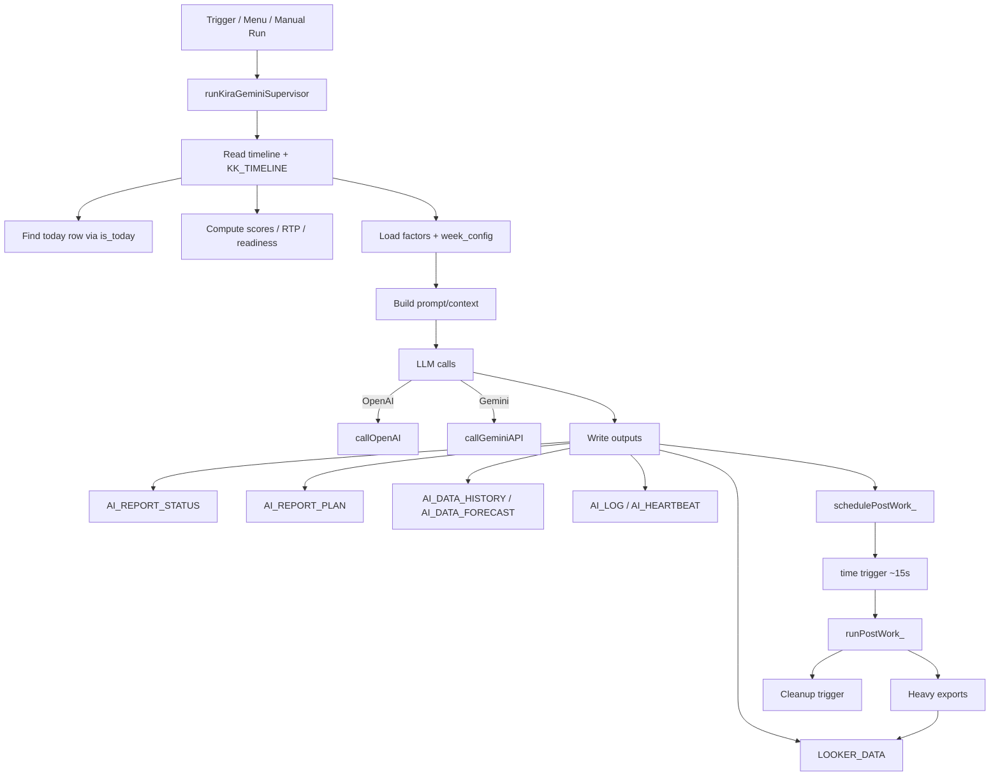

# Coach_Kira — Architecture (Repo ↔ Google Sheet)

This project is a **Google Apps Script** system bound to the Google Spreadsheet **“Coach Kira”**.
The GitHub repo is primarily a **versioned backup** of the Apps Script source (sync via `clasp`).

> Repo: `marvinhhgttg/Coach_Kira`
>
> Spreadsheet: **Coach Kira** (`1ydTDKQ1VmYL-H0U3E_xe1tdYJlEXfydYMYpKZWW5xsQ`)

---

## 1) High-level picture

**Core loop:** collect today’s data → compute metrics/scores → call LLM(s) → write reports + update sheets → (optional) push notifications.

### System overview (Mermaid)



### Components (text map)

```
Google Sheets (Coach Kira)
  ├─ timeline        (formula/source)
  ├─ KK_TIMELINE     (values/target)
  ├─ week_config     (weekly template)
  ├─ KK_*_FACTORS    (load/elevation factors)
  ├─ AI_DATA_*       (forecast/history)
  ├─ AI_REPORT_*     (status/plan/history)
  ├─ LOOKER_DATA     (BI export surface)
  └─ AI_LOG          (central run log)

Apps Script (this repo)
  ├─ KiraGeminiSupervisor.js  (main orchestration + webapp + triggers + AI)
  ├─ ActivityReview.js        (review workflow + menus)
  ├─ FormSubmitHandler.js     (form-driven ingestion)
  └─ *.html                   (webapp/add-on UI)

External APIs
  ├─ OpenAI (GPT)
  ├─ Gemini
  ├─ Weather (OpenWeather/Open-Meteo)
  ├─ Telegram
  └─ (optional) Strava via library
```

---

## 2) Key invariants: two timeline sheets

The code intentionally uses **two** timeline sheets with different roles:

- **`timeline`** (constant `SOURCE_TIMELINE_SHEET = 'timeline'`)
  - *Formula/source sheet*
  - Some write operations intentionally target this sheet so formulas stay “alive”.

- **`KK_TIMELINE`** (constant `TIMELINE_SHEET_NAME = 'KK_TIMELINE'`)
  - *Values/target sheet*
  - Receives synchronized values (especially the current `is_today` row).
  - Used for faster reads in critical paths.

### Sync strategy
A sync function copies from `timeline` → `KK_TIMELINE` (at least today-row, sometimes more):

- `copyTimelineData()` (and related helpers) performs the sync.
- Newer performance improvements try to avoid full-sheet reads by:
  - reading only header row,
  - reading only `is_today` column,
  - reading/writing a single row or single cell.

---

## 3) Entry points (how code runs)

### A) Manual / editor runs
- **`runKiraGeminiSupervisor()`** — the main “daily supervisor” run.

### B) Spreadsheet UI / Add-on
- `onOpen()` appears in multiple files and typically builds custom menus.
- Add-on entry points configured in `appsscript.json`:
  - `kk_addon_home`
  - `kk_addon_onAuth`

### C) WebApp
Defined in `appsscript.json` (Web App access is currently `ANYONE_ANONYMOUS`).

- `doGet(e)` / `doPost(e)`
  - Used by embedded dashboards and “async trigger” endpoints.
- Dashboard export example:
  - `getDashboardDataAsStringV76()`

### D) Triggers
- Time-based triggers exist for supervisor runs and auxiliary tasks.
- **Post-work is asynchronous** (recent change):
  - `schedulePostWork_()` schedules `runPostWork_()` shortly after supervisor.
  - `runPostWork_()` runs heavy work (e.g. RIS update / Looker export) and removes its own trigger.

---

## 4) Dataflow (supervisor run)

A typical supervisor run looks like this:

1) **Pre-checks / initialization**
   - Initialize run ID / heartbeat
   - Optional notification kick-off

2) **TE Balance read (fast path)**
   - Prefer `KK_TIMELINE` and locate row via `is_today`
   - Read only the single TE cell
   - Fallback to `AI_DATA_FORECAST` if needed

3) **Load data for today & recent history**
   - Read today row (and last N days) from timeline sources

4) **Compute scores**
   - RTP / readiness logic
   - Load / strain / monotony / ACWR derived from timeline + factors

5) **Load weekly template**
   - `getWeekConfig()` reads `week_config` and caches it

6) **LLM call(s)**
   - OpenAI: `callOpenAI(prompt)` (JSON schema)
   - Gemini: `callGeminiAPI(prompt)` (structured / text)

7) **Write outputs**
   - Reports: `AI_REPORT_STATUS`, `AI_REPORT_PLAN`, `AI_REPORT_HISTORY`
   - Data: `AI_DATA_HISTORY`, `AI_DATA_FORECAST`
   - BI: `LOOKER_DATA`

8) **Post-work (async)**
   - `schedulePostWork_()` schedules `runPostWork_()`
   - `runPostWork_()` runs heavy exports/updates outside the main execution window

---

## 5) Spreadsheet tabs and their roles (observed)

> Sheet list extracted via Sheets API; not all tabs are used in every run.

### Core time series
- `timeline` — formula/source timeline
- `KK_TIMELINE` — values timeline (50k rows)

### Configuration / factors
- `KK_CONFIG` — operational config (e.g. calendar ID, lat/lon, toggles)
- `config` — numeric constants/parameters (legacy/aux)
- `KK_LOAD_FACTORS` — zone/load factor table
- `KK_ELEV_FACTORS` — elevation factor table
- `week_config` — weekly plan template (CSV-ish)

### AI inputs/outputs
- `AI_DATA_HISTORY` — historical data used by AI/history module
- `AI_DATA_FORECAST` — forecast surface (also used as fallback inputs)
- `AI_REPORT_STATUS` — main daily status output
- `AI_REPORT_PLAN` — plan output
- `AI_REPORT_HISTORY` — history analysis output
- `AI_FUTURE_STATUS` — future status / outlook

### Logs / monitoring
- `AI_LOG` — central append-only log (`logToSheet()`)
- `AI_CHAT_LOG` — chat interaction log
- `AI_HEARTBEAT` — run heartbeats / run-state tracking

### BI / external views
- `LOOKER_DATA` — Looker Studio export surface

---

## 6) Secrets, config, and caching

There are **two config planes**:

### A) PropertiesService
- **ScriptProperties**: secrets & API keys
  - examples: `OPENAI_API_KEY`, `GEMINI_API_KEY`, `OPENWEATHER_API_KEY`
- **DocumentProperties**: cached computed data and snapshots
  - examples: cached factors, cached week_config CSV, PlanApp snapshot

### B) Sheets-based config
- `KK_CONFIG` and `config` are used for runtime parameters editable by the user.

Rule of thumb:
- Secrets → ScriptProperties
- Tuning/template parameters → Sheets
- Caches → DocumentProperties (ideally with a version/TTL)

---

## 7) Developer notes (how to change safely)

### Performance / quota
- Avoid `getDataRange().getValues()` on 50k-row sheets.
- Prefer: header read + narrow column reads + single-row writes.

### Robustness
- Use explicit “contract” checks for required columns (e.g. `date`, `is_today`, `Sport_x`, `Zone`).
- Fail gracefully and log to `AI_LOG` with a clear prefix.

### Security
- WebApp is configured as `ANYONE_ANONYMOUS` in `appsscript.json`.
  - Ensure endpoints are authenticated/guarded if they can mutate state.
  - Keep secrets out of repo and out of the sheet.

---

## 8) Quick index

- Main orchestrator: `KiraGeminiSupervisor.js`
  - `runKiraGeminiSupervisor()`
  - `doGet(e)`, `doPost(e)`
  - `getDashboardDataAsStringV76()`
  - `callOpenAI()`, `callGeminiAPI()`
  - `logToSheet()`
  - `schedulePostWork_()`, `runPostWork_()`

- Sheet ↔ code glue:
  - `timeline` ↔ `KK_TIMELINE` sync (`copyTimelineData` etc.)
  - `week_config` loader (`getWeekConfig`)
  - factor loaders (`getLoadFactors`, `getElevFactors`)

---

*Last updated: 2026-02-01*
