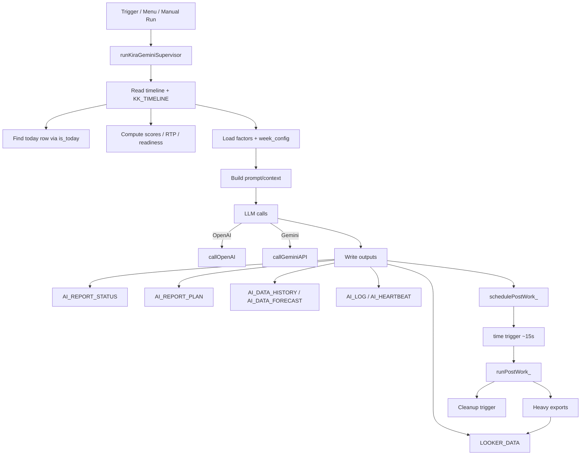

# Coach_Kira — Dataflow Diagram

This doc summarizes the main runtime flows between Sheets, Apps Script, external APIs, and UI.

---

## 1) Core daily run (Supervisor)



---

## 2) Two timeline sheets (source vs values)

```mermaid
flowchart LR
  T[timeline\n(formulas/source)] -->|copyTimelineData / delta sync| K[KK_TIMELINE\n(values/target)]
  K -->|fast reads| S[Supervisor / API endpoints]
  T -->|plan writes| P[Planning flows]\n(updatePlannedLoad etc.)
```

Key idea:
- Writes that should preserve formula propagation usually target `timeline`.
- Reads that must be fast and stable may prefer `KK_TIMELINE`.

---

## 3) WebApp / API endpoints

```mermaid
flowchart TD
  U[Client browser / widgets] -->|GET /exec?page=...| H[HTML templates]
  U -->|GET /exec?mode=json| J[Dashboard JSON]\n(cache + lock
  U -->|GET /exec?mode=timeline| L[Timeline JSON]\n(cache + lock

  H -->|calls back| J
  H -->|calls back| L
```

---

*Last updated: 2026-02-01*
